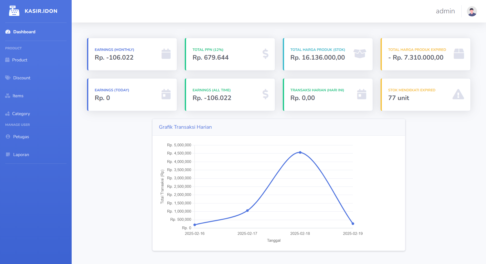
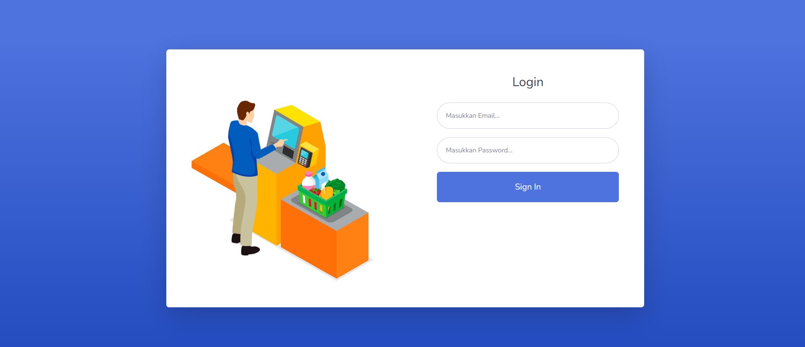
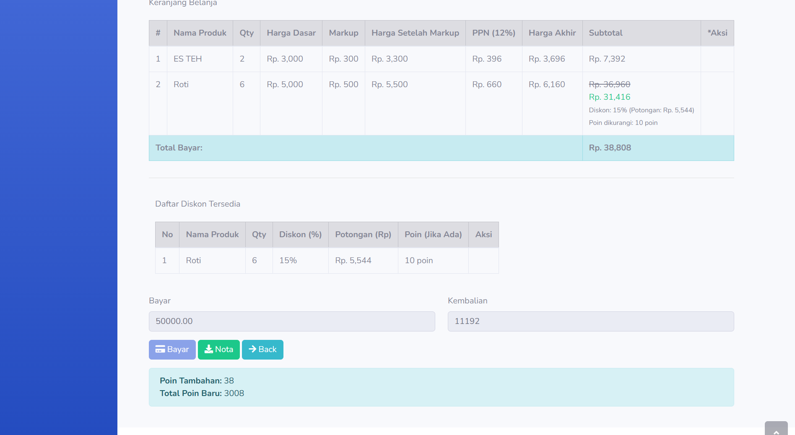
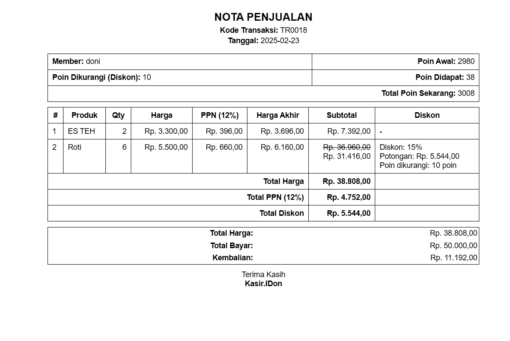

# Kasir.IDon

Kasir.IDon adalah aplikasi **Point of Sale (POS)** berbasis web yang dikembangkan untuk proyek **UKK SMK**. Aplikasi ini dirancang untuk membantu proses transaksi penjualan, manajemen stok, serta sistem diskon dan membership.

## ✨ Fitur Utama

### 1. Transaksi Penjualan
Fitur utama aplikasi ini memungkinkan kasir untuk melakukan transaksi dengan mudah dan cepat, termasuk menambahkan produk ke keranjang, menerapkan diskon, dan memproses pembayaran.


### 2. Multi-User Login
Terdapat tiga jenis pengguna dengan hak akses berbeda:
- **Admin**: Mengelola semua fitur aplikasi.
- **Kasir**: Melakukan transaksi penjualan.
- **Petugas**: Mengelola stok barang.


### 3. Manajemen Barang & Stok
- Tambah, edit, dan hapus produk.
- Stok barang dapat diatur dengan **expired date** untuk menghindari produk kadaluarsa.


### 4. Sistem Diskon & Membership
- **Diskon** bisa diatur oleh admin dengan berbagai syarat, seperti produk tertentu, jumlah minimal pembelian, dan poin yang diperlukan.
- **Membership** memungkinkan pelanggan mengumpulkan poin dari transaksi dan menukarkannya untuk diskon.


### 5. Laporan Penjualan
- Laporan dapat **diekspor ke format spreadsheet** untuk analisis lebih lanjut.
- Menampilkan data penjualan berdasarkan rentang tanggal tertentu.


### 6. Pencetakan Nota
- Setiap transaksi dapat dicetak sebagai bukti pembayaran untuk pelanggan.
- Nota mencantumkan rincian transaksi, termasuk diskon yang diterapkan.


### 7. Dashboard Interaktif
- Menampilkan **grafik penjualan** untuk analisis tren.
- Notifikasi **stok barang yang hampir habis**, sehingga admin dapat mengelola stok dengan lebih efisien.
- Ringkasan transaksi terbaru dalam satu tampilan.

---


## Demo Aplikasi

### 1. Dashboard  
[](images/dashboard.png)

### 2. Login Multi-User  
[](images/login.png)

### 3. Transaksi Penjualan  
[](images/transaksi.png)

### 4. Pencetakan Nota  
[](images/nota.png)


## 🚀 Instalasi & Inisialisasi

Ikuti langkah-langkah berikut untuk menjalankan aplikasi ini di lokal:

### 1. Clone Repository
```bash
git clone https://github.com/Doni354/Kasir.IDon
cd Kasir.IDon
```


### 2. Install Dependensi
```bash
composer install
```


### 3. Konfigurasi Database
- Buat database baru dengan nama yang sesuai di file `.env`.
- Ubah nama file `.env.example` menjadi `.env`.
- Import database yang telah disediakan:
  ```bash
  mysql -u root -p database_name < kasirukk.sql
  ```


### 4. Migrasi & Seed Database
```bash
php artisan migrate --seed
```

### 5. Jalankan Aplikasi
```bash
php artisan serve
```
Akses aplikasi melalui `http://127.0.0.1:8000`.


---

## 📌 Akun Default
Berikut adalah akun default untuk masuk ke dalam aplikasi:

- **Admin**
  - Email: `admin@gmail.com`
  - Password: `admin`


---

## 📜 Lisensi
Proyek ini dikembangkan untuk keperluan **UKK SMK** dan dapat digunakan serta dimodifikasi sesuai kebutuhan.

---

## ⭐ Dukung Proyek Ini
Jika proyek ini bermanfaat, jangan lupa untuk **star repository ini** di GitHub! 

Untuk melihat fitur lengkapnya, kamu bisa **mencoba langsung dengan menginisialisasi proyek ini** di komputer kamu. 🚀

**Kasir.IDon - POS Web App** | Dibangun dengan **Laravel & MySQL**


